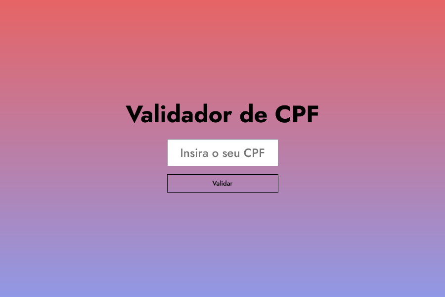

<h1 align="center">
   Validador de CPF
</h1>

 

<h2 align="center"><a href="https://isaacnreis.github.io/validaCPF/">Clique para visitar o projeto</a></h2>

---

## 👾 Tecnologias utilizadas

- HTML5
- CSS3
- JavaScript
- JQuery
- Visual Studio Code

---

## Sobre o projeto

Projeto desenvolvido no programa de seleção de novos estágiarios da empresa Teknisa

---